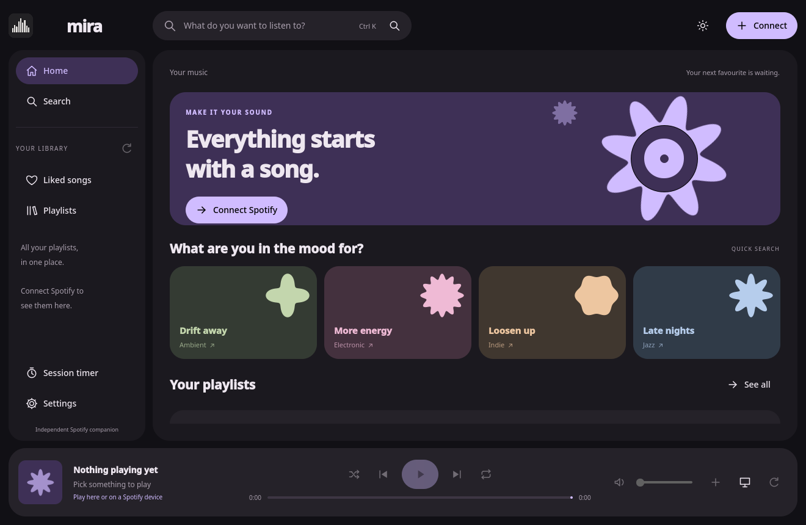

# BE WARNED this was a test to see how astra performs with one prompt.


# Mira

*Formerly called Luwte. Settings and a saved sign-in from Luwte are carried over automatically on first start.*

An independent Qt 6 music companion for Spotify with a Material Expressive interface: library sidebar, global search bar, playlist cards, compact track lists with album art and a fixed player bar with a wavy progress line. Rounded panels, tonal colours and shapes are visually inspired by Caelestia Shell, without using its code. Three accent palettes, light/dark themes and keyboard control; the sidebar collapses into a compact navigation rail in small windows. The session timer is optional and lives in the sidebar. The working name and version are set in `cmake/AppIdentity.cmake` (`-DAPP_NAME=...` overrides the visible name).



## Getting started

Mira talks to Spotify through your **own** free Spotify Developer app. That takes about five minutes, once. You need **Spotify Premium** to play music.

### 1. Download and install

Get the newest version from the [Releases page](../../releases).

- **Windows:** download `mira-…-win64.exe` and run it. Windows may say the app is from an unknown publisher: click **More info → Run anyway**.
- **macOS:** download `mira-…-Darwin.dmg`, open it and drag Mira to Applications. The first time, **right-click Mira → Open → Open**; on newer macOS versions go to **System Settings → Privacy & Security** and click **Open Anyway**. If macOS says Mira "is damaged and can't be opened", run this once in Terminal, then open it again:

  ```sh
  xattr -dr com.apple.quarantine /Applications/mira.app
  ```

  (Built on Apple Silicon; Intel Macs are untested.)
- **Fedora / RPM-based Linux:** download `mira-…-Linux.rpm` and run `sudo dnf install ./mira-…-Linux.rpm`. Other distributions: see [building](#building-and-running-locally).

The app is not code-signed, which is why your system warns you. That is expected for a hobby project.

### 2. Create your own Spotify Client ID

1. Go to https://developer.spotify.com/dashboard and log in with your Spotify account. Accept the developer terms if asked.
2. Click **Create app** and fill in:
   - **App name:** anything, for example `My Mira`
   - **App description:** anything, for example `Personal music player`
   - **Redirect URIs:** exactly `http://127.0.0.1:43821/callback`, then click **Add**. Use `127.0.0.1`, not `localhost`.
   - **Which API/SDKs are you planning to use?** tick **Web API** and **Web Playback SDK**
3. Agree to the terms and click **Save**.
4. Open your new app, go to **Settings** and copy the **Client ID** (a long string of letters and numbers).

You do not need the **Client secret**. Never paste it into Mira or share it.

### 3. Connect Mira

1. Open Mira and go to **Settings** (gear icon, or Ctrl+3).
2. Paste your Client ID into the **Spotify Client ID** field.
3. Click **Connect Spotify**, log in in your browser and click **Agree**. You can close the browser tab afterwards.
4. Done. Mira starts its built-in player and becomes your active Spotify device. Pick a song or open **Liked songs**.

### If something does not work

- **"Spotify refused this action"**: check that you have Premium and that the redirect URI and both API checkboxes from step 2 are correct.
- **No sound inside Mira**: the built-in player needs Widevine (protected-audio support), which not every computer has. Click the device button in the player bar and pick your normal Spotify app (phone, desktop app or speaker) instead; Mira then works as a remote control. See [built-in playback](docs/PLAYBACK.md).
- **Port 43821 in use**: close other apps that might use it and try again.

## Building and running locally

Requires: CMake >=3.24, a C++20 compiler, Ninja, Qt >=6.8 with Core/Gui/Network/Concurrent/Quick/Qml/QuickControls2/ShaderTools/WebEngineQuick/WebEngineCore/WebChannel (including Qt Positioning), plus Qt DBus on Linux. Qt is linked dynamically. M3Shapes is vendored at a pinned version, so nothing is downloaded during configure.

Fedora (RPM):

```sh
sudo dnf install gcc-c++ cmake ninja-build qt6-qtbase-devel qt6-qtdeclarative-devel qt6-qtshadertools-devel qt6-qtwebengine-devel qt6-qtwebchannel-devel libsecret rpm-build
cmake --preset release
cmake --build --preset release --parallel 2
./build/mira
```

On Linux a working user session with Secret Service (GNOME Keyring, or KWallet with Secret Service) and `/usr/bin/secret-tool` is needed to stay signed in. Without a keyring the app keeps tokens in memory only. The focus timer needs no extra service.

Windows: install Qt 6.8+ MSVC 2022 x64, Visual Studio C++ Build Tools, CMake/Ninja and NSIS; run the CMake commands above in a Developer PowerShell with Qt on PATH/CMAKE_PREFIX_PATH. Start `build/mira.exe`.

macOS: install the Xcode command-line tools, Qt 6.8+ for macOS, CMake and Ninja; set CMAKE_PREFIX_PATH to the Qt prefix. Start `open build/mira.app`.

## Spotify setup details

The [getting started](#getting-started) steps cover the normal setup. Technical details:

1. Open https://developer.spotify.com/dashboard and create your own Developer app. This project contains no credentials.
2. Register exactly `http://127.0.0.1:43821/callback`; do not use `localhost`.
3. Add your account to the allowed users when the Developer console requires it. New Development Mode apps have limited access; the owner must have Premium and new apps support at most five authorised users. The July 2026 documentation lists at most 25 apps and shared quotas per developer account.
4. Enter the public Client ID in Settings, or start with `SPOTIFY_CLIENT_ID=... ./build/mira`. **No client secret.** The environment variable takes precedence.
5. Select Web Playback SDK in your Developer app. Click Connect Spotify and grant access in the system browser. By default Mira then starts its built-in player and makes this computer the active Spotify device, unless music is already playing on another device (switch this off in Settings, or use **Listen on this computer** with the device button). After updating from 0.2 you must connect again for the SDK scopes.
6. In-app audio needs Widevine and suitable codecs. See [built-in playback](docs/PLAYBACK.md) for installation and checks. Other Spotify devices remain available.

PKCE uses a cryptographically random verifier, S256 and state, binds only to IPv4 loopback and has a short callback timeout. Tokens are refreshed automatically on the next action; a 401 gets at most one refresh attempt. Signing out cancels authorisation and ignores responses from earlier sessions.

| Scope | Feature |
| --- | --- |
| user-read-playback-state | Devices, current track, shuffle/repeat, restrictions |
| user-modify-playback-state | Play, pause, previous, next, seek, shuffle, repeat, transfer and supported device volume |
| user-library-read | Read saved tracks |
| user-library-modify | Save/remove a track via `/me/library` |
| playlist-read-private | Your own list of public/private playlists and accessible content |
| streaming | Audio via the Web Playback SDK (Premium) |
| user-read-email, user-read-private | SDK account access required by Spotify; Mira does not store email/profile data |

Search needs no extra scope. No top-items or playlist-write scopes. Playlists are read and can be started as a playback context; creating/editing stays in Spotify. Pages load only on request. Playback state is refreshed after controls, every 20 seconds while the window is active, at the end of each track, and every minute in the background while a remote device plays; the app pauses refreshing on quota errors. Progress is interpolated locally between responses. Playback controls run independently of page loading, so they stay usable while a list loads. Offline, loading, empty, HTTP error, Premium/access and quota messages are present; background errors appear as a short snackbar. Retry-After is honoured; playback is never retried automatically after a network error.

## Player and keyboard

The progress line follows Material 3 Expressive: the played part waves while music plays and flattens when paused. Click or drag it to seek; with the line focused, ← / → seek 5 seconds. The player bar also has shuffle, repeat (off → all → one), mute and a volume slider (scroll wheel supported); choosing a different device while music plays moves playback there. Liked songs is pinned as the first card on Home and in the sidebar (Ctrl+2); it loads 50 songs at a time, has Play and Shuffle buttons and a filter field (Ctrl+F) that searches the loaded songs, and also works inside playlists. Starting a song keeps playing what comes after it: in a playlist the rest of the playlist, in Liked songs your whole Liked songs collection (Shuffle shuffles the whole collection), in search results the other results. What happens after the last song follows the Autoplay setting of your Spotify account. Click the cover or title in the player bar (or press Ctrl+P) for a large player view with the cover, a blurred background and all controls. Right-click a song for Play from here, Add to queue, Search artist, Save and Copy link. The track playing now is highlighted in lists, the window title shows it, and the track menu can copy its Spotify link. The window size is remembered.

| Shortcut | Action |
| --- | --- |
| Space | Play/pause (when no button or text field has focus) |
| Ctrl+← / Ctrl+→ | Previous / next track |
| Shift+← / Shift+→ | Seek 10 seconds |
| Ctrl+↑ / Ctrl+↓ | Volume ±10 |
| Ctrl+M | Mute/unmute |
| Ctrl+S / Ctrl+R | Shuffle / cycle repeat |
| Ctrl+D | Device picker |
| Ctrl+P | Open or close the large player view (Esc closes it) |
| Ctrl+K | Search (Esc clears) |
| Ctrl+F | Filter liked songs or the open playlist |
| Ctrl+1 / Ctrl+2 / Ctrl+3 | Home / Liked songs / Settings |

## Desktop media controls (Linux)

On Linux Mira registers an MPRIS 2 player (`org.mpris.MediaPlayer2.mira`) on the session bus. KDE Plasma's media widget, GNOME's media controls, lock screens, `playerctl` and hardware media keys show the current title, artists, album and cover, and can play/pause, skip, seek, change volume, shuffle and repeat. "Raise" brings the Mira window to the front. This works for the built-in player and for remote Spotify devices. Chromium's own media-session integration is disabled inside the embedded player so only one entry appears. Windows (SMTC) and macOS (Now Playing) integrations are not implemented yet.

## Focus and privacy

The optional session timer sits at the bottom of the sidebar, not on the music home screen. Calm, Bright and Space only change that timer view. Session length 5–120 minutes, pause/resume/reset. The timer triggers no Spotify actions, sounds or alarm music. No listening history, profiles, statistics, metadata export or Spotify catalogue service. See [privacy](docs/PRIVACY.md).

## Limitations

- Built-in audio uses the official Web Playback SDK with Premium, Widevine and AAC. Qt WebEngine is not explicitly on Spotify's list of supported browsers; this integration is experimental and live audio has not been verified here. Other Spotify clients can change the current state.
- Development Mode can refuse endpoints/content. Playlist content is limited to owned/collaborative playlists. Removed/region-locked and local tracks are not played from this app.
- No Spotify logo, by explicit request. Textual attribution and links back are present, but Spotify's design rules require a logo/icon. **Resolve this with Spotify before public distribution.** This project claims no endorsement or official affiliation.
- Live OAuth/API validation requires your Client ID/account and could not be performed without credentials. Native Windows/macOS builds and signing must be validated on their runners.
- The token keyring protects storage, not against software already running with your OS account's rights.

## Structure and releases

`src/`: separate OAuth, WebPlayback, API, keyring, preferences, timer and MPRIS components. `qml/`: interface. `third_party/`: vendored M3Shapes source. `cmake/` and `packaging/`: metadata/installers. `.github/workflows/release.yml`: native platform builds. No test suites run or included in the workflow, as requested.

Build a package for the current platform: `cpack --config build/CPackConfig.cmake -B dist`. See the [release process](docs/RELEASE.md) for the Windows .exe, Linux .rpm, macOS .app/.dmg, signing/notarisation and Qt licence sources. [Source research](docs/SOURCES.md) records API and dependency choices. Own code/icons: MIT; other components: [notices](THIRD_PARTY_NOTICES.md).

The local checks actually performed and the artefacts produced are listed in [BUILD_STATUS](docs/BUILD_STATUS.md).

## Local development build

In the current development environment the extra Fedora Qt packages were unpacked without root under `/tmp/luwte-qt-webengine`. Start this build with `./scripts/run-local.sh`; the script reads the Qt path from the CMake cache and sets the WebEngine resource paths. These temporary files may disappear after a reboot. For permanent use install the system packages listed above and reconfigure CMake with `-DCMAKE_PREFIX_PATH= -DQT_ADDITIONAL_PACKAGES_PREFIX_PATH=` (or use a clean build directory).
